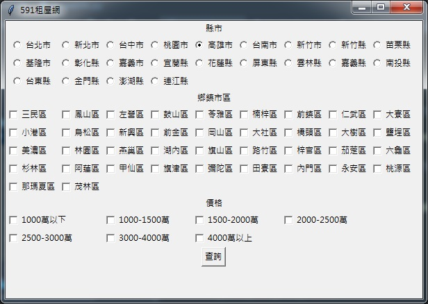
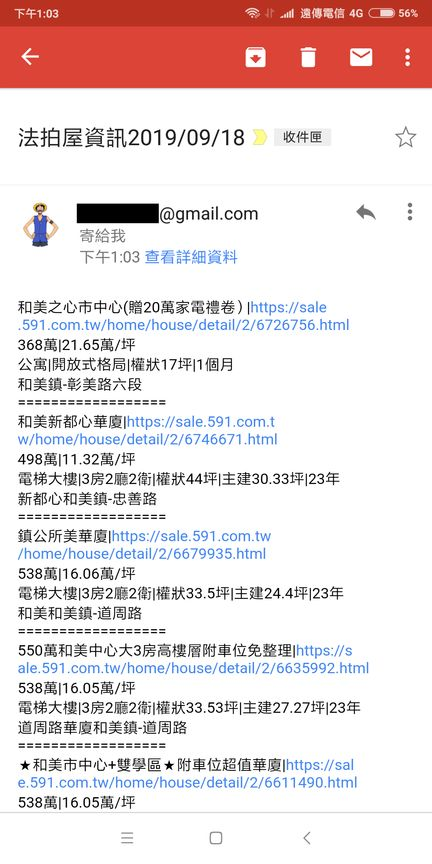

## HouseInfo
該程式是利用爬蟲技術(requests,Selenium)，針對台灣特定鄉鎮市區、特定價格，爬取591法拍屋資訊後，
將結果發送至指定信箱。若有意買法拍屋者，可將該批次檔加入電腦排程定時爬取相關資訊，彙整後，寄信通知相關人員。

## 操作界面:tkinter



## 彙整寄至信箱



## 使用
```shell
先設定json/config.json，將相關參數設定好，再選擇下面兩種方式操作

1.直接執行查詢，並把結果寄到信箱
  python.exe HouseInfo.py --auto 

2.進入圖型化操作介面
  python.exe HouseInfo.py
```
## json/config.json設定檔說明 
```
urlSMTP :  SMTP伺服器設定 資料型態string ex:smtp.gmail.com:587
passwd :  信箱密碼 資料型態string
mail_from :  寄件者信箱 資料型態string ex:john123@gmail.com
receivers : 收件人信箱，可設定多個，資料型態list  ex:["judy003@gmail.com","vivi004@gmail.com"]
county :  縣市代碼，參考 json/county.json 資料型態string
section :  鄉鎮市區代碼，參考 json/section.json 資料型態string
priceRange :  價格設定，可設定多個，用逗號隔開，參考 json/priceRange.json 資料型態string ex:0_200,200_400

```